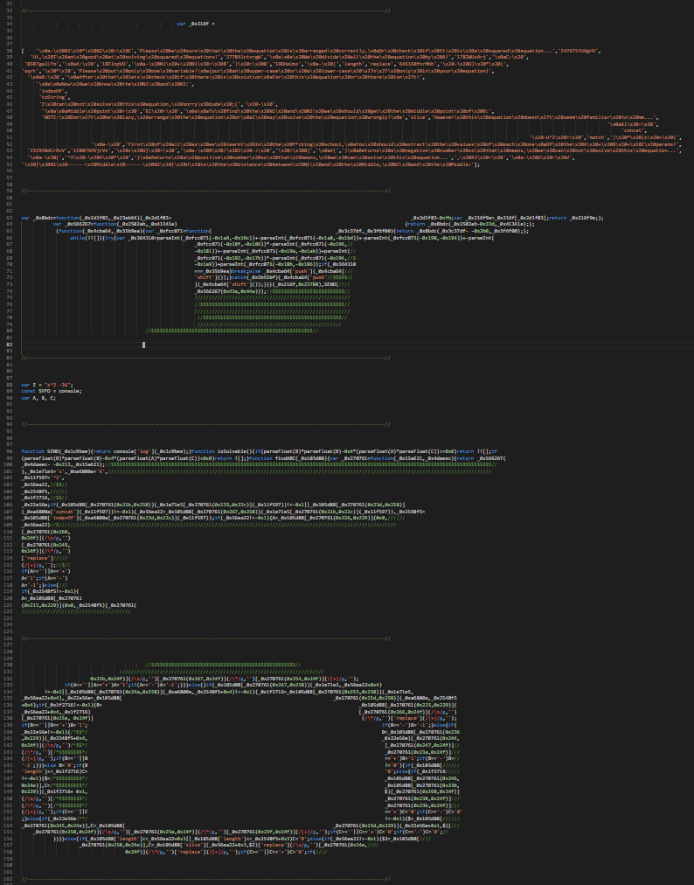

# SYFO-AI
## ! WELCOME FROM 7WDEV(Ade Issawe) !

#### How To Use?
1-just install the js file from here-github (you can use both the obfuscated one and the normal one) !

2-edit the I constant value and run the code !
```
var I = "2x^2 +4x -4"; //feel free to change the equation xd
const SYFO = console;
var A, B, C;
```
3-enjoy !
```
NOTE: Don't be lazy, arrange the equation or
I may solve the equation wrongly!

First of all as we learnt in the f*cking school,
You should extract the values of each one
Of the A + B + C params!
A: 2
B: 4
C: -4

After that lets check if there is solution
For this equation or there isn't!

√(4^2 - 4 * 2 * -4)
Returns a positive number so that means, we can solve this equation...

Lets solve it via Trinom:
- [2x^2 +4x -4 = 0]

 We divide all the equation by A!
- N1 + N1 = B
- N1 * N2 = C
- (x + N1) * (x + N2)

To find the N1 and N2 we should get the middle point of B:
- B / 2 -> 1

Middle point = 1 | N1 ------ Middle ------ N2 | U is the distance between N1 and the Middle, N2 and the Middle:
- (1 - U) * (1 + U) = -2
- 1 -U^2 = -2
- -U^2 = -3
- U = √3

Now we know the N1 and N2:
- (x + (1 - √3) * (x + (1 + √3) = 0
X1 = 0.7320508075688772, X2 = -2.732050807568877
```

This code is free to use I coded it for educational and experemintal uses only, I was challenging myself to make a bot that can solve quadric equations without using complicated algorithms or libs...




#### Info
Name: SYFO-AI

Type: Bot

Author: 7Wdev

Version: 0.2.0-alpha

All copyrights are reserved!

Feel free to edit the code, feel free to contribute...

Desctription: Basic AI that can solve squared(quadric) equations...

Known issues: this bot does not understand Roots, Fractions, the Quadric Formula(law), Can not arrange the equation etc...

This AI uses Trinom(law) to solve the equations!
